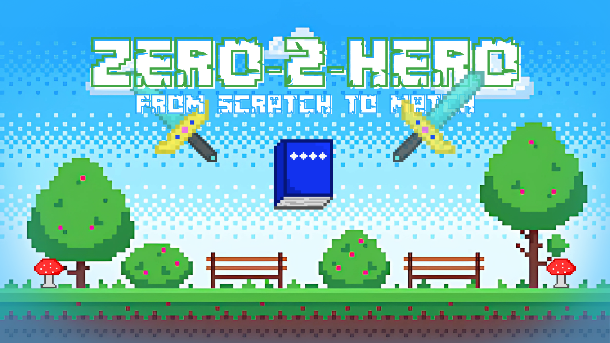

# 🌟 Zero-2-Hero!  
## 📌 Overview  
An individual workshop series that builds **programming fundamentals step by step** — from basic syntax and control flow to data structures and object-oriented programming.  
Perfect for turning **complete beginners into confident coders**.  

---

## 🎯 Objectives  
- Introduce participants to **core programming concepts**  
- Build a solid foundation in **syntax, logic, and problem-solving**  
- Develop skills in **data structures and OOP principles**  
- Empower beginners to transition into **intermediate coding challenges**

---

## 📚 Topics  
- **Programming Basics** – Syntax, variables, data types  
- **Control Flow** – Conditionals, loops, logical operators  
- **Functions & Modular Code** – Reusability and clean coding practices  
- **Data Structures** – Arrays, lists, stacks, queues  
- **Object-Oriented Programming** – Classes, objects, inheritance, polymorphism  

---

## 📋 Event Details  
- **Type of Event:** Workshop · Series (Individual Participation)  
- **Level:** Beginner → Intermediate  
